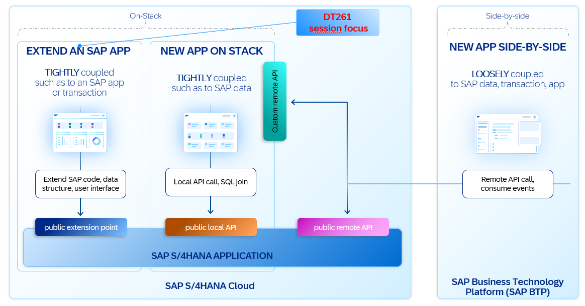
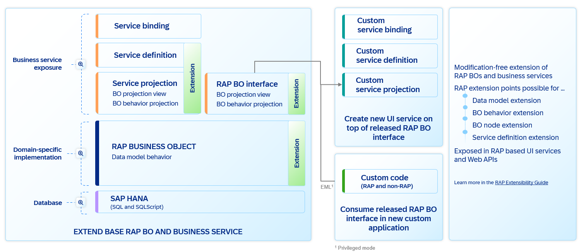

# TechEd2025 - DT261 - Build on-stack extensions with ABAP Cloud in SAP Cloud ERP

- [TechEd2025 - DT261 - Build on-stack extensions with ABAP Cloud in SAP Cloud ERP](#teched2025---dt261---build-on-stack-extensions-with-abap-cloud-in-sap-cloud-erp)
  - [💬Session Overview](#session-overview)
    - [🗺️ SAP S/4HANA Cloud extensibility patterns](#️-sap-s4hana-cloud-extensibility-patterns)
    - [🗺️ Today‘s focus: On-stack developer extensibility options](#️-todays-focus-on-stack-developer-extensibility-options)
  - [🗺️ RESTful ABAP Programming Model - Extensibility Overview](#️-restful-abap-programming-model---extensibility-overview)
  - [🛠️ Exercises](#️-exercises)
  - [ℹ️ Further Information](#ℹ️-further-information)

## 💬Session Overview

This repository contains the material for the SAP TechEd 2025 session **DT261 - Build on-stack extensions with ABAP Cloud in SAP Cloud ERP**.

It gives you an overview of the RAP extensibility architecture, extension development artifacts and available extensibility features.

**Developer extensibility as defined by SAP basically encompasses two main activities:**

1. Develop custom code to implement your own business logic. 

   → Here you can make use of existing API's from SAP that have been released for that purpose.
   
3. Extend an existing RAP Business Object so that additional business functionality is added.

   → Such an extensible RAP business object will usually reside in another software components or it is an existing extensible RAP BO that has been delivered by SAP or a SAP partner. By extending the functionality of an existing RAP Business object its functionality can be adapted to your specific business requirements.

### 🗺️ SAP S/4HANA Cloud extensibility patterns

   

### 🗺️ Today‘s focus: On-stack developer extensibility options

   

## 🗺️ ABAP RESTful Application Programming Model - Extensibility Overview

Extensibility in RAP (ABAP RESTful Application Programming Model) empowers application consumers to tailor existing applications to meet specific business requirements and processes through RAP extensions. These extensibility features are built with lifecycle stability in mind and ensure a clear separation of concerns between the original business object (BO) and its extensions. Each extension is self-contained and consistently managed by RAP, regardless of whether the BO is managed or unmanaged.
By default, a RAP BO is not extensible. To enable extensibility, the original BO provider must explicitly allow it by defining dedicated extension points. These points can be finely controlled, giving precise authority over which parts of the BO can be extended and what types of extensions are permitted.

Once extensibility is enabled, extension providers can enhance the original BO by adding various types of extensions to its data model and behavior. However, they are restricted to only those extension types that the original BO has been configured to support. Attempting to define unsupported fields or behaviors will result in syntax errors in the extension BDEF and related data model extension objects.

From the consumer’s perspective, extensions are seamlessly integrated into both the design-time and runtime environments of the BO. Although extensions are self-contained, they function as part of the overall BO. Importantly, extensions can only define behavior for their own elements and operations—they cannot override or modify the behavior of the original BO elements.

For an architecture overview, see [Extensibility Architecture Overview](https://help.sap.com/docs/abap-cloud/abap-rap/extensibility-architecture-overview?locale=en-US&version=LATEST)

## 🛠️ Exercises

The main aspect of developer extensibility is the option to extend an extensible RAP business object that has been delivered by SAP or an SAP partner.

| Overview | -- |
| ------------- | -- |
| [Exercise: Getting Started: Connect and Logon](exercises/ex00/README.md) | Logon to your S/4HANA Public Cloud system. |
| [Exercise 1: Extend the behavior of a RAP business object (determinations, validations, side-effects)](exercises/ex01/README.md) | You will _extend the behavior_ of the base RAP business object that has been already pre-generated by your instructor. You will learn how to extend the behavior of the base RAP BO by validations, determinations and side effects.  |
| [Exercise 2: Extend the CDS data model of the extensible RAP base business object](exercises/ex02/README.md) | You will then continue to _extend the data model_ with additional fields  |
| [Exercise 3: Extend the business object with an action](exercises/ex03/README.md) | You will continue to _extend the behavior_ of the base RAP business object by adding an action. Since actions can only be added via an extension to fields that have been added itself via an extension, adding an action via an extension must be performed after Exercise 2 |

## ℹ️ Further Information

| SAP Help Portal  |  |
| ------ | -- |
| [ABAP RESTful Application Programming Model](https://help.sap.com/docs/abap-cloud/abap-rap/abap-restful-application-programming-model?locale=en-US&version=LATEST)| The ABAP RESTful Application Programming Model (in short RAP) defines the architecture for efficient end-to-end development of intrinsically SAP HANA-optimized OData services (such as Fiori apps) in ABAP Cloud. |
| [RAP Extensibility-Enablement](https://help.sap.com/docs/abap-cloud/abap-rap/rap-extensibility-enablement?locale=en-US&version=LATEST) | Explains the concepts of how to enable a custom RAP BO for extension development. |
| [Develop RAP Extensions](https://help.sap.com/docs/abap-cloud/abap-rap/develop-rap-extensions?locale=en-US&version=LATEST) | This site offers how-to information and implementation examples for extending a ABAP RESTful Application Programming Model (RAP) Business Object. |

 

Let's go to [Exercise - Getting Started - Connect and Logon](exercises/ex00/README.md)
