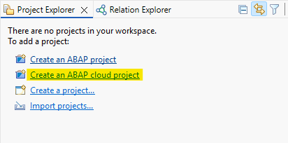
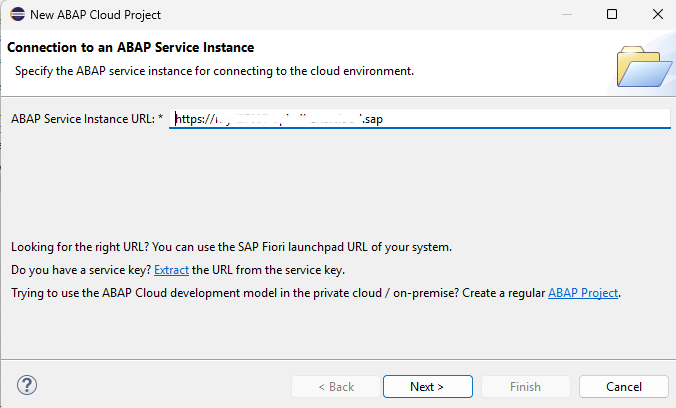
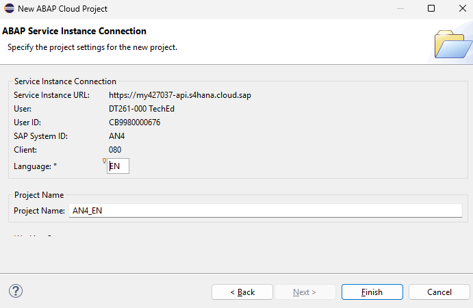
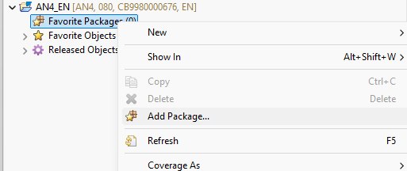
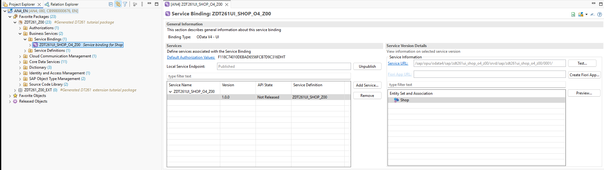
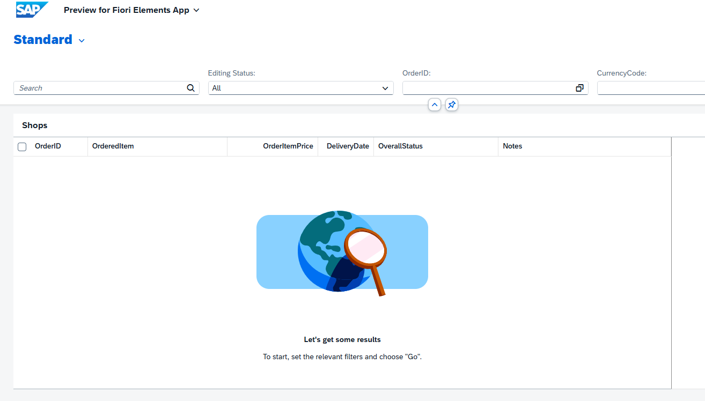

# Getting Started

- [Getting Started](#getting-started)
  - [🔴 Important Information](#-important-information)
  - [🔐 System and Logon Information](#-system-and-logon-information)
  - [🌐 Exercise - Getting Started - Connect and Logon](#-exercise---getting-started---connect-and-logon)
  - [Summary](#summary)

## 🔴 Important Information

> **📌 Note**   
> We’ve got sessions running in several locations → please pick the one that’s right for you!

> **📌 Replace the last two digits to get your group number:**
> * ZDT261_**0##** → **01** → **40** → **SAP TechEd Berlin**  (e.g ``ZDT261_019``)
> * ZDT261_**1##** → **00** → **99** → **ASUG Tech-Connect**  (e.g ``ZDT261_123``)

 

## 🔐 System and Logon Information

<table>
  <tr>
    <th>Key</th>
    <th>Value</th>
  </tr>
  <tr>
    <td>S/4HANA Public Cloud System - <b>AN4</b> -</td>
    <td>⚠ <b>will be provided by your instructors</b> ⚠</td>
  </tr>
  <tr>
    <td>User</td>
    <td>DT261-###@education.cloud.sap</td>
  </tr>
  <tr>
    <td>Password</td>
    <td>⚠ <b>will be provided by your instructors</b> ⚠</td>
  </tr>
  <tr>
    <td>Exercise Package</td>
    <td>ZDT261_###  <i>Don't forget to replace all occurences of the placeholder ### with your assigned location and group number in the exercise steps below.</i></td>
  </tr>
</table>

## 🌐 Exercise - Getting Started - Connect and Logon
1. Logon to 

2. Start ABAP Development Tools

3. Create a New Cloud Project
   <!---->
   

4. Enter the URL of your system: ⚠**Provided by your instructor**⚠
   

5. Authenticate with the provided user (### your group number)
    * User: DT261-###@education.cloud.sap
    * Pasword:  **will be provided by the instructors**

8. Finish the New Project Creation Wizard
   
   

9. Add your exercise packages as Faviorite Packages
   
   There are two exercise packages: `ZDT261_###` and `ZDT261_###_EXT`

   

10. Open your Service Binding `ZDT261UI SHOP_O4_###` and launch the Fiori Elements Preview to test the already provided Fiori application.

   

   
 
## Summary

You successfully logged on the your system, added your favorite packages and launched the Fiori Elements Preview for the provided application.

Let's continue with the [Exercise 1](../ex01/README.md)
