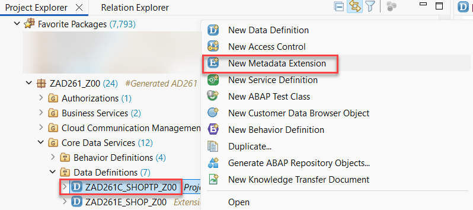
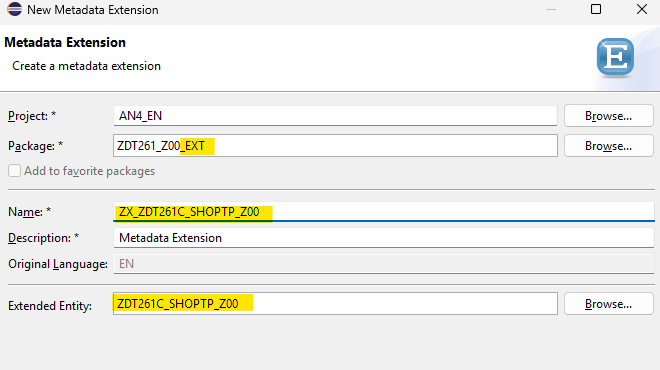
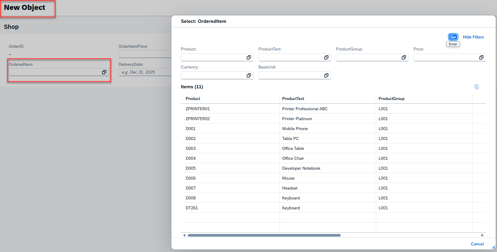
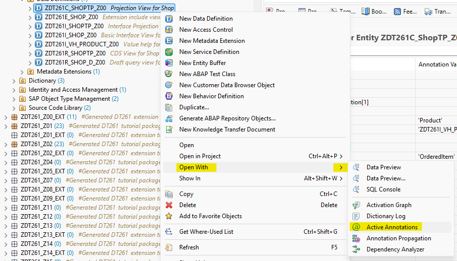
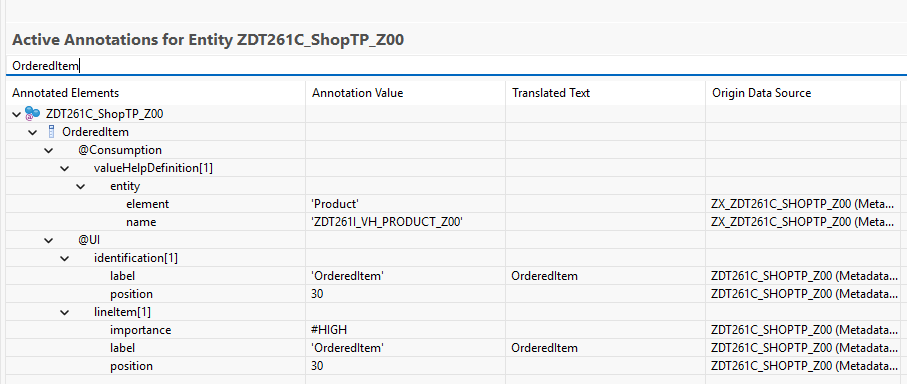
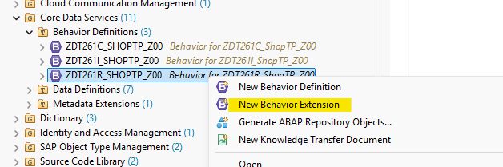
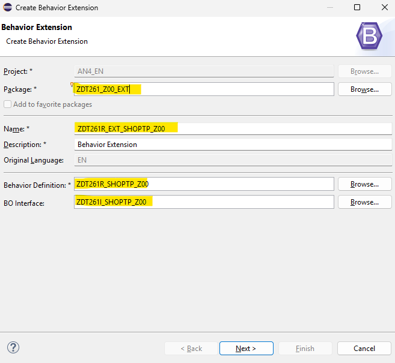
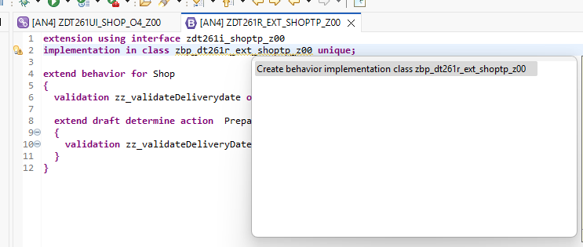
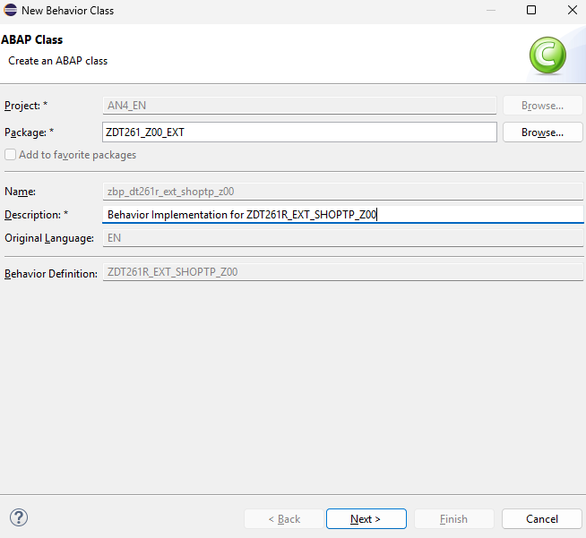
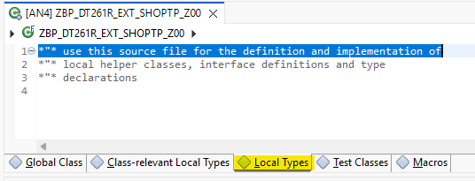

[Home - Cloud ERP Extensibility](../../../../#exercises)

# Exercise 1 - Extend the behavior of a RAP business object

- [Exercise 1 - Extend the behavior of a RAP business object](#exercise-1---extend-the-behavior-of-a-rap-business-object)
  - [🔴 Important Information](#-important-information)
  - [🔍 Description](#-description)
  - [Exercise 1.1 Extend the Metadata Extension with a value help definition](#exercise-11-extend-the-metadata-extension-with-a-value-help-definition)
  - [Exercise 1.2 Extend the behavior definition with a validation](#exercise-12-extend-the-behavior-definition-with-a-validation)
  - [Exercise 1.3 Extend the behavior definition with a determination](#exercise-13-extend-the-behavior-definition-with-a-determination)
  - [Exercise 1.4 Extend the behavior definition with side effects](#exercise-14-extend-the-behavior-definition-with-side-effects)
  - [Summary](#summary)

## 🔴 Important Information

> **📌 Note**   
> We’ve got sessions running in several locations → please pick the one that’s right for you!

> **📌 Replace the last two digits to get your group number:**
> * ZDT261_**0##** → **01** → **40** → **SAP TechEd Berlin**  
> * ZDT261_**1##** → **00** → **99** → **ASUG Tech-Connect**

 

## 🔍 Description

In this exercise, we will extend the behavior of an extensible RAP BO. That means we will add a validation, a determination and side-effects to the behavior of the RAP BO by using an extension.    

    

## Exercise 1.1 Extend the Metadata Extension with a value help definition

1. Create a Metadata Extension to add a value help to search products.

    ⚠ Please make sure to use the ``_EXT`` package ⚠

    **Package**: `ZDT261_###_EXT`       
    **Name**: `ZX_ZDT261C_ShopTP_###`  
    **Description**: `Extension for ZDT261C_SHOPTP_###`    
    **Extended Entity**: `ZDT261C_SHOPTP_###`  

    
    

2. Implement the Metadata Extension
<pre lang="ABAP">
  @Metadata.layer: #CUSTOMER
  annotate entity ZDT261C_ShopTP_### with 
  {
    @Consumption.valueHelpDefinition: [ {
      entity: {
        name: 'ZDT261I_VH_PRODUCT_###',
        element: 'Product'
      }
    } ]
    OrderedItem;
  }
</pre> 

3. Save and Activate.

4. Open your Service Binding `ZDT261UI SHOP_O4_###` and launch the Fiori Elements Preview or simply refresh the already opened Fiori Elements Preview. Now you can use the value help in order to search for a product.

    

5. If you're curious about the annotations being applied, the Active Annotations View in the ABAP Development Tools (ADT) can provide valuable insights into how this influences the UI behavior.

    
    

## Exercise 1.2 Extend the behavior definition with a validation

>  After completing these steps you will have created a validation to check the delivery date.  

1. Right-click on the behavior definition `ZDT261R_ShopTP_###` and select **New Behavior Extension** from the context menu. 

    

2. In the Create Behavior Extension dialogue enter the following values

    > **⚠⚠⚠ Caution**     
    > Be sure to change the name of the package from `ZDT261_###` to `ZDT261_###_EXT`.
    > By default the dialogue will propose the package name of the base RAP BO.  
    > In case of a package delivered by SAP an error message would be thrown since you are not allowed to create objects in the SAP namespace.
    > But here we want to build the extension in a different package in the customer namespace `Z`.
    
    **Package**: ⚠`ZDT261_###_EXT`⚠   
    **Name**: `ZDT261R_EXT_SHOPTP_###`  
    **Description**: `Extension for ZDT261R_ShopTP_###`    
    **Behavior Definition**: `ZDT261R_SHOPTP_###`  
    **BO Interface**: `ZDT261I_SHOPTP_###`  

    

3. Finish, Save and Activate.
   
4. Add a validation `zz_validateDeliverydate` to your behavior definition that reacts on `create;` and the field `DeliveryDate;`  
   This validation must also be added to the `draft determine action Prepare`. Do not forget to activate your changes.   
 
   <pre lang="ABAP">
   extension using interface ZDT261I_shoptp_###
   implementation in class zbp_dt261R_ext_shoptp_### unique;

   extend behavior for Shop
   {     
     validation zz_validateDeliverydate on save { create;   field DeliveryDate; }

     extend draft determine action  Prepare
     {
       validation zz_validateDeliveryDate;
     }
   }  
   </pre> 

   
5. Click on the proposed name of the behavior implementation class of your behavior extension and press **Ctrl+1** to start the content assist and click on the proposed action and press Finish.  
   
    
    
   
6. This will open the editor for your behavior implementation class. Here you have to navigate to the **Local Types** tab since the implementation of behaviors takes place in local classes.    

    

7. Add the following code to the local class `lhc_shop` which implements the validation. 

   <pre lang="ABAP">   
   CLASS lhc_shop DEFINITION INHERITING FROM cl_abap_behavior_handler.   
   
     PUBLIC SECTION.  
       CONSTANTS state_area_check_delivery_date       TYPE string VALUE 'CHECK_DELIVERYDATE'       ##NO_TEXT.   
     PRIVATE SECTION.  
       METHODS zz_validateDeliverydate               FOR VALIDATE ON SAVE  
         IMPORTING keys FOR Shop~zz_validateDeliverydate.  
   
   ENDCLASS.  
   
   CLASS lhc_shop IMPLEMENTATION.  
   
     METHOD zz_validateDeliverydate.  
       READ ENTITIES OF ZDT261I_ShopTP_### IN LOCAL MODE  
               ENTITY Shop  
               FIELDS ( DeliveryDate OverallStatus )  
               WITH CORRESPONDING #( keys )  
               RESULT DATA(onlineorders).  
   
       LOOP AT onlineorders INTO DATA(onlineorder).  
         APPEND VALUE #( %tky           = onlineorder-%tky  
                         %state_area    = state_area_check_delivery_date )  
                TO reported-shop.  
         DATA(deliverydate)             =  onlineorder-DeliveryDate - cl_abap_context_info=>get_system_date(  ).  
         IF onlineorder-deliverydate IS INITIAL  .  
           APPEND VALUE #( %tky           = onlineorder-%tky ) TO failed-shop.  
           APPEND VALUE #( %tky           = onlineorder-%tky  
                           %state_area    = state_area_check_delivery_date  
                           %msg           = new_message_with_text(  
                                               severity = if_abap_behv_message=>severity-error  
                                               text     = 'delivery period cannot be initial'  
                          ) )  
                   TO reported-shop.  
         ENDIF.  
       ENDLOOP.  
     ENDMETHOD.  
   ENDCLASS.  
   </pre>  

8.  Save and Activate.
   
9.  Open the service binding `ZDT261UI_SHOP_O4_###` of your RAP base BO.

10. Double-click on the entity **Shop** . This will start the ADT preview of the Shop RAP BO.  

    

11. Press the **Create** button on the list page.
12. The **New : Shop** object page opens where you have to enter the data for a new order.      
13. Select a product for the field **OrderedItem** but do **NOT** select a **Delivery Date**
14. Press **Create**.   
15. This shall raise the follwoing error message:   

    

## Exercise 1.3 Extend the behavior definition with a determination

In a second step we will now add a determination `ZZ_setOverallStatus` to the behavior definition extension. This shall be executed in case the content of the field `OrderedItem` is changed by the user.   

 
1. Add the following statement to your behavior definition extension `ZDT261R_EXT_SHOPTP_###`.     

   <pre lang="ABAP">
     determination ZZ_setOverallStatus on modify {  field OrderedItem; }
   </pre>
       
   The code for your BDEF should now be as follows:
   <pre lang="ABAP">   
   extension using interface ZDT261I_shoptp_###
     implementation in class ZBP_DT261R_EXT_SHOPTP_### unique;
 
   extend behavior for Shop
   {
     validation zz_validateDeliverydate on save { create; field DeliveryDate; }
 
     extend draft determine action Prepare
      {
        validation zz_validateDeliveryDate;
       }
     determination ZZ_setOverallStatus on modify { field OrderedItem; }
    }
   </pre>

2. Press **Ctrl+1** to start the content assist and double-click on the proposal to add the appropriate code in the behavior implementation class `ZBP_DT261R_EXT_SHOPTP_###`. 

3. Add the following code into the implementation of the method `ZZ_setOverallStatus`. Do not forget to replace all occurrences of `###` with your group number.   
   
   > The code first performs a read request using EML using the key fields of our RAP BO that are provided by the framework and reads the data of all affected 
   > orders. In the following loop statement it is checked whether the price exceeds a certain threshold (1000 EUR) and depending on the price the order is 
   > either automatically approved or is awaiting an approval.   
   > The price for a product is read from an CDS view and the instance of the RAP BO is modified accordingly.    
 
   <pre lang="ABAP">
   METHOD ZZ_setOverallStatus.

    DATA update_bo      TYPE TABLE FOR UPDATE     ZDT261I_ShopTP_###\\Shop.
    DATA update_bo_line TYPE STRUCTURE FOR UPDATE ZDT261I_ShopTP_###\\Shop .

    READ ENTITIES OF ZDT261I_ShopTP_### IN LOCAL MODE
      ENTITY Shop
        ALL FIELDS " ( OrderItemPrice OrderID )
        WITH CORRESPONDING #( keys )
      RESULT DATA(OnlineOrders)
      FAILED DATA(onlineorders_failed)
      REPORTED DATA(onlineorders_reported).

    DATA(product_value_help) = NEW ZDT261_cl_vh_product_###(  ).
    data(products) = product_value_help->get_products(  ).

    LOOP AT onlineorders INTO DATA(onlineorder).

      update_bo_line-%tky = onlineorder-%tky.

      SELECT SINGLE * FROM @products as hugo
         WHERE Product = @onlineorder-OrderedItem  INTO @data(product).

      update_bo_line-OrderItemPrice = product-Price.
      update_bo_line-CurrencyCode = product-Currency.

      IF product-Price > 1000.
        update_bo_line-OverallStatus = 'Awaiting approval'.
      ELSE.
        update_bo_line-OverallStatus = 'Automatically approved'.
      ENDIF.
    
      APPEND update_bo_line TO update_bo.
    ENDLOOP.

    MODIFY ENTITIES OF ZDT261I_shoptp_### IN LOCAL MODE
      ENTITY Shop
        UPDATE FIELDS (
        OverallStatus
        CurrencyCode
        OrderItemPrice
        )
        WITH update_bo
       REPORTED DATA(update_reported).

    reported = CORRESPONDING #( DEEP update_reported ).

    ENDMETHOD.
   
   </pre>

3. > When you get the error message:   
   > The entity "SHOP" does not have a determination "ZZ_SETOVERALLSTATUS".	 
   > This might be, because you have not activated your BDEF yet.   

4. Create a new entity and select an item or change the item of an existing entity,  
   **but don't save your changes** so that only the draft is affected.   

   > You will notice that the draft data for the item name is updated, but the price is NOT updated in the draft.
   > Also the approval status does not change in the draft if the product price becomes larger than 1000 Euro.  
   > The data will only be updated in the UI once you save your data.  
   > This we will change in the following step of our exercise by using side effects.

## Exercise 1.4 Extend the behavior definition with side effects

Now you can continue and add side effects via your behavior definition extension.

> Please note:  
> An extension via side effects is only possible if the extensible RAP business objects provide the `use side effects` statement in its behavior projection or in its interface projection. 
> Since the statement `use side effects` can not be added via an extension itself this has thus to be foreseen by the developer.  

1. Open the behavior extension `ZDT261R_Ext_ShopTP_###` by pressing **Ctrl+Shift+A**.
2. Add the following code snippet  
   
   <pre lang="ABAP">side effects { field OrderedItem affects field OrderItemPrice , field CurrencyCode  , field OverallStatus ; }</pre>  

   to your behavior extension right after the determination. 
 
   Your BDEF extension code should now read as follows:  

   <pre lang="ABAP">
     extension using interface ZDT261I_shoptp_###
       implementation in class zbp_rap630r_ext_shoptp_### unique;
 
       extend behavior for Shop
    {
      validation zz_validateDeliverydate on save { create; field DeliveryDate; }
      extend draft determine action Prepare
      {
        validation zz_validateDeliveryDate;
       }
     determination ZZ_setOverallStatus on modify { field OrderedItem; }
     side effects { field OrderedItem affects field OrderItemPrice , field CurrencyCode , field OverallStatus ; }
     }
    </pre>

3. Create a new order, specify a delivery data or open an existing order and switch to the edit mode and then select a (new) product. 
   
   You will notice that the data for the product that you have selected in the SAP Fiori UI is being updated automatically.  
   Also the approval status changes if the price changes from below 1000 Euro to a value that is larger than 1000 Euro and vice versa.    
   
    
 

## Summary

You've now extended the behavior of the base RAP business object. For this you only had to create an extension of the BDEF of the base BO on the R-layer.

Continue to - [Exercise 2 - Extend the data model ](../ex02/README.md)

